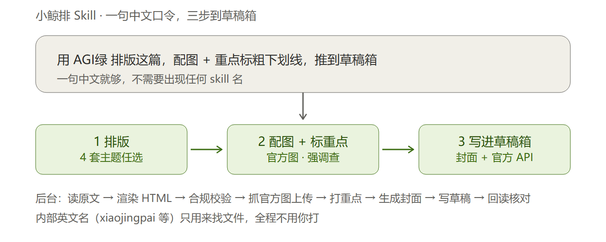

# 小鲸排 Skill

把一篇腾讯文档，排成鲸选AI 风格的公众号文章，配好图和重点，直接写进公众号草稿箱。

- **中文名**：小鲸排 Skill
- **英文名**：`xiaojingpai`（拼音，三个 skill 共用这个前缀）
- **一句话**：你说一句中文，它排版 → 配图 → 标重点 → 写进草稿箱

## 怎么装（一句话，让 Agent 自己装）

不用自己下载。打开你的办公 Agent，发这一句：

```
帮我装这三个 skill：从 GitHub 克隆到 skills 目录，装完检查依赖、告诉我怎么用。

https://github.com/jxshow/xiaojingpai
https://github.com/jxshow/xiaojingpai-render
https://github.com/jxshow/xiaojingpai-push
```

它会自己 clone、放对目录、检查运行时，缺什么会告诉你。装完**重启一次** Agent。需要你亲自做的只有一步：把公众号 AppID / AppSecret 写进 `~/.workbuddy/wechat/.env`（细节见 `new-machine-setup.md`）。

> 三个仓库是私有仓库，需要这台机器有 GitHub 访问权限。

## 它怎么干活（三步）



一句中文口令进来，剩下全自动：

1. **排版** —— 读腾讯文档原文（连「原文哪里加粗」都读出来，不靠猜），按主题渲染成公众号 HTML，跑合规校验
2. **配图 + 标重点** —— 抓官方图上传到微信素材库，按准则标「整句加粗」和「关键词下划线」
3. **写进草稿箱** —— 生成主题色封面，走官方 API 写入草稿箱，再回读核对微信没吞样式

## 平时怎么用

在 WorkBuddy 里发一句**中文**就行，不用打英文 skill 名：

```
用 AGI绿 排版这篇，配图 + 重点标粗下划线，推到草稿箱：

https://docs.qq.com/doc/XXXX
```

最省事的写法：`排这篇推草稿箱：<链接>`（默认 AGI绿）。

更多说法（换主题、只预览、更新已有草稿、关键词怎么念）见同目录的 **口令卡.md**。

## 整条链路

```
腾讯文档 ──读原文/加粗──▶ article.base.json ──apply_marks──▶ article.json
                                                              │
                                                     render_article.mjs
                                                              ▼
                                                        article.html
                                                    （合规校验 + 预览）
                                                              │
                    官方新闻稿抓图 ──upload_images──▶ mmbiz 地址 ┘
                                                              ▼
                                       make_cover + push_to_wechat_draft
                                                              ▼
                                                        公众号草稿箱
```

## 三个 skill 各管什么

| skill | 中文 | 作用 |
|---|---|---|
| `xiaojingpai` | 小鲸排 · 总控 | 流程、通用脚本、合规校验、口令（**入口看这里**） |
| `xiaojingpai-render` | 小鲸排 · 排版引擎 | 4 套主题（字节绿 / AGI绿 / 杂志绿 / Pro蓝）+ 确定性渲染器 |
| `xiaojingpai-push` | 小鲸排 · 草稿推送 | 官方 API 推送草稿箱 + 主题色封面生成 |

## 默认约定

| 项 | 值 |
|---|---|
| 主题 | AGI绿（`agi-green`），主色 `#2ea250` |
| 作者 | `鲸选AI` |
| 封面 | 900×383，同主题色 |
| 重点 | 整句 `strong` 黑粗 + 短关键词 `underline` 2px 主题色下划线，不自行编造 |
| 英文标签 | 原文有才写，没有就省略整行 |
| 来源 | 官方新闻稿优先；图注标图源 |

## 安全底线

1. **只用官方 API 推草稿箱，不开浏览器扫码登录。**
2. **`draft/update` 是整篇替换** —— 后台被手工改过就拒绝覆盖，先问再用 `--force`。
   **后台的原创声明、合集、赞赏等标记会一起丢，要重新设。**
3. **不擅自改写原文**：文字、顺序、数字、链接一律保真；只做排版和既有的强调。
4. `.env` 含明文密钥，不进仓库、不发截图、不传公开网盘。

## 仓库

三个 skill 都在 GitHub（私有），可以 clone 到任何电脑：

| skill | 仓库 |
|---|---|
| `xiaojingpai` | `jxshow/xiaojingpai` |
| `xiaojingpai-render` | `jxshow/xiaojingpai-render` |
| `xiaojingpai-push` | `jxshow/xiaojingpai-push` |

凭据 `.env` **不在任何仓库里**，换机器要单独搬。

## 换电脑

见 `new-machine-setup.md`。三种方式任选：从 GitHub clone（推荐，可随时 pull 更新）、用打包 zip、直接拷目录。
无论哪种，最后都要放好 `.env` + 把新机器的公网 IP 加进公众号后台白名单。

## 来源与许可

排版引擎的工作流衍生自开源项目 [gzh-design-skill](https://github.com/isjiamu/gzh-design-skill)
（作者 甲木 Jiamu / 摸鱼小李 Moyu Xiaoli，AGPL-3.0-or-later），保留其 LICENSE 与作者声明。
合规校验脚本已内联进 `xiaojingpai/scripts/validate_html.py`（文件头标注了出处），
因此**不再需要额外安装上游 skill**。渲染器、品牌主题与后续流水线为定制新增。
